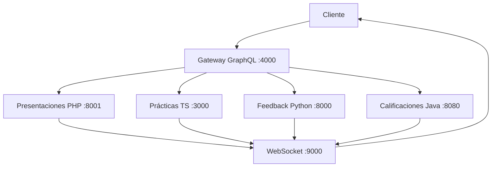

# ExposIA – Asistente de Exposición Oral

## 🚀 Segundo Parcial - Arquitectura de Microservicios

### Nuevos Componentes Implementados

#### 1. **API Gateway GraphQL** (TypeScript)
- **Puerto:** 4000
- **Endpoint:** http://localhost:4000/graphql
- **Playground:** http://localhost:4000/graphql (modo desarrollo)
- **Funcionalidad:** Punto único de entrada que unifica todos los microservicios
- **Schema:** Unifica entidades de todos los módulos con consultas complejas

#### 2. **Servicio de Notificaciones WebSocket** (Python)
- **Puerto:** 9000
- **WebSocket:** ws://localhost:9000/ws/{client_id}
- **REST API:** http://localhost:9000/notify
- **Funcionalidad:** Notificaciones en tiempo real entre módulos
- **Cliente de prueba:** websocket-notifications/src/client_test.html

### Arquitectura Distribuida

```
┌─────────────────┐    ┌──────────────────┐    ┌─────────────────┐
│   Frontend      │───▶│  Gateway GraphQL │───▶│  Microservicios │
│   (Cliente)     │    │   (Puerto 4000)  │    │                 │
└─────────────────┘    └──────────────────┘    └─────────────────┘
                                │                        │
                                ▼                        ▼
                       ┌──────────────────┐    ┌─────────────────┐
                       │  WebSocket       │◀───│  Notificaciones │
                       │  (Puerto 9000)   │    │  entre módulos  │
                       └──────────────────┘    └─────────────────┘
```

### Microservicios Adaptados

| Módulo | Puerto | Lenguaje | Notificaciones Implementadas |
|--------|--------|----------|-------------------------------|
| **Presentaciones** | 8001 | PHP (Laravel) | ✅ presentacion.creada, presentacion.eliminada |
| **Prácticas** | 3000 | TypeScript (NestJS) | ✅ grabacion.creada |
| **Feedback IA** | 8000 | Python (FastAPI) | ✅ feedback.creado, metrica.creada |
| **Calificaciones** | 8080 | Java (Spring Boot) | ✅ calificacion.creada, calificacion.ia.aplicada |


**Implementacion y equipo de desarrollo: Carlos Chile, Anthony Mejia, William Cabrera**

**Fecha de creación:** 2025-05-07  
**Actualización Segundo Parcial:** 2025-01-09

**Repositorio de diseño original del sistema ExposIA.**

---

## 🧠 Descripción

**ExposIA** es una propuesta de sistema educativo apoyado en inteligencia artificial que permite a estudiantes mejorar sus habilidades de oratoria mediante prácticas estructuradas, retroalimentación automatizada y análisis de desempeño.

Este repositorio documenta la evolución del sistema hacia una **arquitectura de microservicios distribuida** con **API Gateway GraphQL** y **notificaciones en tiempo real**.

---

## 🏗️ Arquitectura de Microservicios (Segundo Parcial)

### Componentes Principales

1. **API Gateway GraphQL** - Punto único de entrada
2. **Servicio WebSocket** - Notificaciones en tiempo real  
3. **4 Microservicios REST** - Funcionalidades específicas
4. **Bases de datos independientes** - PostgreSQL por módulo

### Flujo de Comunicación



---

## 🚀 Inicio Rápido

### Opción 1: Docker Compose (Recomendado)

```bash
# Clonar repositorio
git clone <repository-url>
cd ExposIA

# Levantar toda la arquitectura
docker-compose up --build

# Verificar servicios
curl http://localhost:4000/graphql  # Gateway GraphQL
curl http://localhost:9000/health   # WebSocket Service
```

### Opción 2: Desarrollo Local

```bash
# Terminal 1: Gateway GraphQL
cd gateway-graphql
npm install
npm run dev

# Terminal 2: WebSocket Service
cd websocket-notifications
pip install -r requirements.txt
python src/main.py

# Terminal 3-6: Microservicios existentes
# (Ver instrucciones específicas en cada módulo)
```

---

## 📊 Endpoints y Servicios

### Gateway GraphQL (Puerto 4000)

**Consultas Principales:**
```graphql
# Obtener todas las presentaciones con relaciones
query {
  presentaciones {
    id
    titulo
    usuario { nombre email }
    tema { nombre }
    slides { numeroSlide textoSlide }
    grabaciones {
      id
      fechaGrabacion
      calificaciones { puntajeGlobal }
    }
  }
}

# Estadísticas del sistema
query {
  estadisticasGenerales {
    totalUsuarios
    totalPresentaciones
    totalGrabaciones
    promedioCalificaciones
    presentacionesPorTema {
      tema { nombre }
      cantidad
      promedioCalificacion
    }
  }
}

# Crear nueva presentación
mutation {
  crearPresentacion(input: {
    titulo: "Mi Presentación"
    usuarioId: "1"
    temaId: "2"
  }) {
    id
    titulo
    usuario { nombre }
  }
}
```

### WebSocket Service (Puerto 9000)

**Conexión WebSocket:**
```javascript
const ws = new WebSocket('ws://localhost:9000/ws/client-123?room=general');

ws.onmessage = (event) => {
  const notification = JSON.parse(event.data);
  console.log('Notificación recibida:', notification);
};
```

**Enviar Notificación (REST):**
```bash
curl -X POST "http://localhost:9000/notify?token=dev" \
  -H "Content-Type: application/json" \
  -d '{
    "event": "test.notification",
    "payload": {"message": "Hola mundo"}
  }'
```

---

## 🧪 Testing

### Tests del Gateway GraphQL
```bash
cd gateway-graphql
npm test
```

### Tests del WebSocket Service
```bash
cd websocket-notifications
python -m pytest src/test_websocket.py -v
```

### Cliente de Prueba WebSocket
Abrir en navegador: `websocket-notifications/src/client_test.html`

### Flujo de Integración Completo
```bash
# 1. Crear presentación (PHP) -> Notificación WebSocket
curl -X POST "http://localhost:8001/api/presentaciones" \
  -H "Authorization: Bearer <jwt-token>" \
  -F "titulo=Test Presentation" \
  -F "id_tema=1" \
  -F "archivo_pdf=@test.pdf"

# 2. Consultar desde GraphQL
curl -X POST "http://localhost:4000/graphql" \
  -H "Content-Type: application/json" \
  -d '{"query": "{ presentaciones { id titulo } }"}'

# 3. Verificar notificación en WebSocket
# (Usar cliente HTML o conectarse programáticamente)
```

---

## 📁 Contenido
- **gateway-graphql/:** API Gateway unificado en TypeScript
- **websocket-notifications/:** Servicio de notificaciones en Python
- **backend/:** Microservicios REST originales adaptados
  - **presentaciones-php/:** Gestión de presentaciones (Laravel)
  - **practicas-ts/:** Grabaciones y prácticas (NestJS)  
  - **feedback-ia-python/:** Análisis con IA (FastAPI)
  - **calificacion-java/:** Sistema de calificación (Spring Boot)
- **infra/:** Infraestructura de desarrollo
- **Flujo de datos simulado:** muestra paso a paso la experiencia del usuario y cómo interviene la IA.
- **Modelo de base de datos:** incluye diseño de tablas y relaciones entre entidades.
- **Documento técnico:** describe los módulos del sistema, tecnologías empleadas y arquitectura modular.

---

## 🔧 Stack Tecnológico

### Arquitectura de Microservicios
- **API Gateway:** TypeScript + Apollo GraphQL
- **Notificaciones:** Python + FastAPI + WebSockets
- **Orquestación:** Docker Compose

### Microservicios
- **PHP (Laravel)** – Gestión de presentaciones y PDFs
- **TypeScript (NestJS)** – Grabaciones y fragmentación de audio
- **Python (FastAPI)** – Análisis de IA y feedback automatizado
- **Java (Spring Boot)** – Sistema de calificación y evaluación
- **PostgreSQL** – Base de datos por microservicio

---

## 🧑‍💻 Equipo de Desarrollo

### Primer Parcial

| Nombre              | Lenguaje     | Módulo                |
|---------------------|--------------|------------------------|
| William Cabrera     | TypeScript   | Prácticas              |
| Carlos Chile        | Java          | Calificacion          |
| Anthony Mejía       | PHP           | Presentaciones       |
| (Pendiente)         | Python         | Feedback / IA           |

### Segundo Parcial (Rotación de Lenguajes)

| Nombre              | Nuevo Lenguaje | Nuevo Módulo           |
|---------------------|----------------|------------------------|
| Carlos Chile        | TypeScript     | **Gateway GraphQL**    |
| Anthony Mejía       | Python         | **WebSocket Service**  |
| William Cabrera     | Java           | Adaptación Prácticas   |

---

## 📈 Métricas y Monitoreo

### Estadísticas Disponibles
- **Gateway GraphQL:** `/graphql` - Consulta `estadisticasGenerales`
- **WebSocket Service:** `GET /stats` - Conexiones activas y métricas
- **Health Checks:** Todos los servicios exponen `/health`

### Logs y Debugging
```bash
# Ver logs de todos los servicios
docker-compose logs -f

# Ver logs específicos
docker-compose logs -f gateway_graphql
docker-compose logs -f websocket_notifications
```

---

## 🔒 Seguridad

### Autenticación por Servicio
- **Presentaciones PHP:** JWT Bearer Token
- **Prácticas TS:** API Key en header
- **Feedback Python:** Bearer Token
- **Calificaciones Java:** Basic Auth
- **WebSocket:** Token en query parameter

### Variables de Entorno
```bash
# Gateway GraphQL
PRESENTACIONES_JWT_TOKEN=your-jwt-token
PRACTICAS_API_KEY=mi-token-seguro
FEEDBACK_API_KEY=test-api-key-12345
WS_NOTIFICATION_TOKEN=dev

# Calificaciones Java
CALIFICACION_API_USER=admin
CALIFICACION_API_PASS=admin123
```

---

## 🚧 Desarrollo y Contribución

### Agregar Nueva Funcionalidad al Gateway
1. Definir tipos en `gateway-graphql/src/schema/typeDefs.ts`
2. Implementar resolvers en `gateway-graphql/src/resolvers/`
3. Agregar data source si es necesario
4. Escribir tests en `gateway-graphql/src/__tests__/`

### Agregar Nuevo Tipo de Notificación
1. Enviar desde microservicio: `POST /notify`
2. Definir routing en `websocket-notifications/src/main.py`
3. Actualizar cliente de prueba si es necesario

### Estructura de Notificaciones
```json
{
  "event": "entidad.accion",
  "payload": {
    "id": 123,
    "data": "...",
    "timestamp": "2025-01-09T10:30:00Z",
    "source": "nombre-microservicio"
  }
}
```

---

## 📚 Documentación Adicional

- **Gateway GraphQL:** Ver schema en GraphQL Playground
- **WebSocket API:** Documentación automática en `/docs`
- **Microservicios:** README individual en cada carpeta
- **Arquitectura:** Diagramas en `/docs`

---

## 🎯 Roadmap

### Completado ✅
- [x] API Gateway GraphQL unificado
- [x] Servicio WebSocket para notificaciones
- [x] Adaptación de microservicios existentes
- [x] Testing básico e integración
- [x] Docker Compose para orquestación

### Próximos Pasos 🔄
- [ ] Autenticación unificada en Gateway
- [ ] Caching con Redis
- [ ] Rate limiting y throttling
- [ ] Métricas avanzadas con Prometheus
- [ ] Deployment en cloud (Render/Railway)

---

## ⚖️ Licencia

Este proyecto está cubierto bajo la Licencia MIT. Puedes reutilizarlo y adaptarlo dando crédito al autor original.